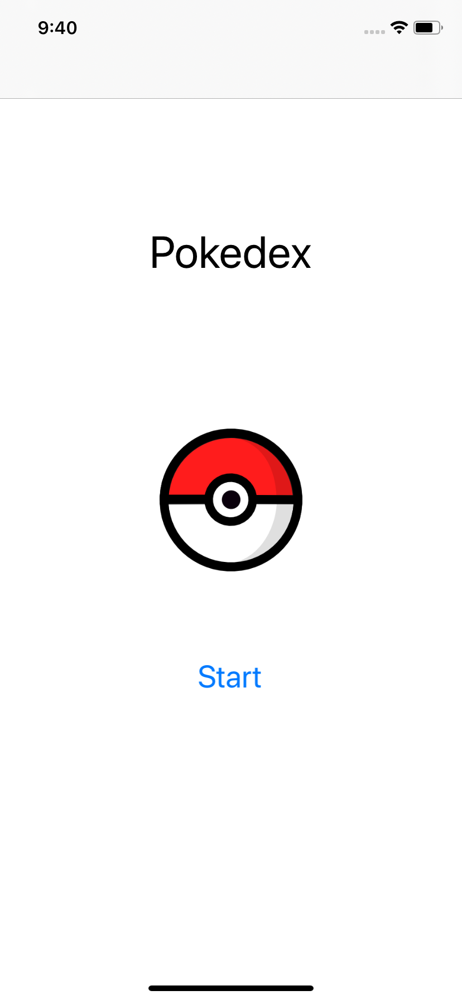
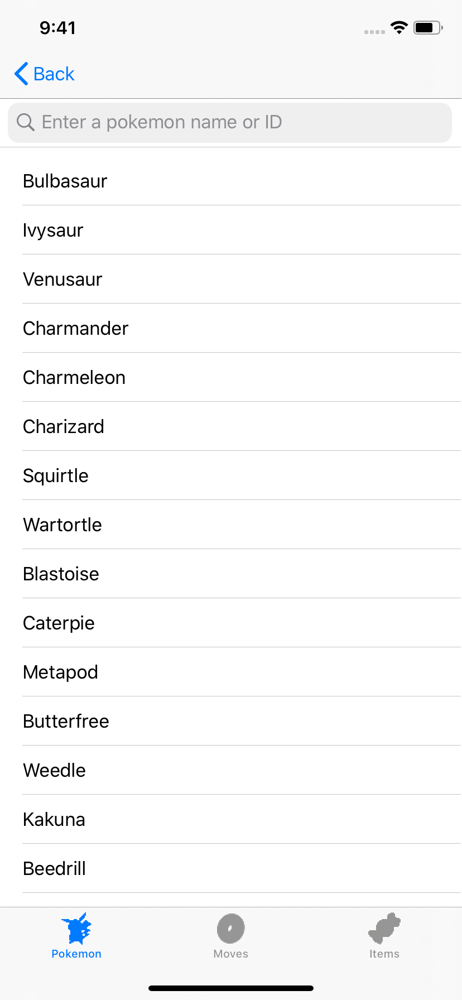
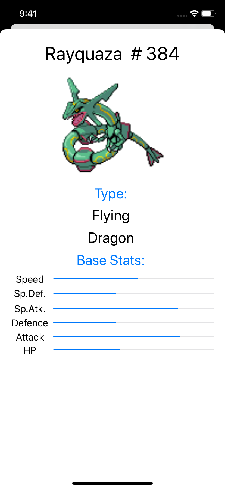
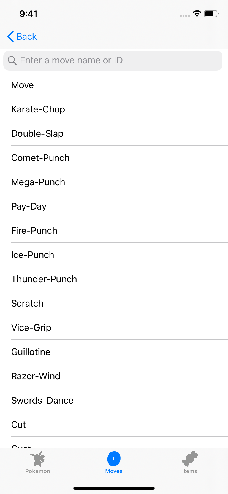
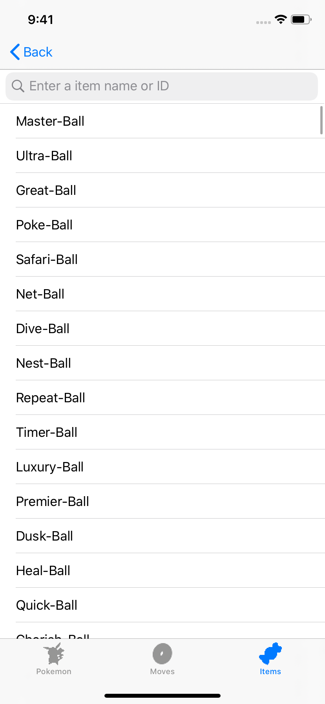

# Pokedex_Test_iOS
iOS App that uses PokeAPI to make a pseudo pokedex, ideally should be runned on an Iphone 11/Xr for layout reasons. 
A testdrive video of the app running on an actual iPhone XR can be found here: https://youtu.be/lDJbhoRB1qE 

